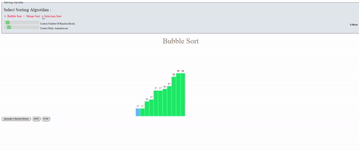

# Sorting Visualizer

This project was inspired by @clementmihailwscu. This project is a demonstration of some of most known sorting algorithms and visualizing the mechanisim with animated colors in order to clearly be usefull for beginners to know how sorting algorithm works.
This project was implemented using javeScript as a backend along with HTML and CSS as frontend.

Sorting Algorithms includes :

## Live Demo

- Bubble Sort
- Merge Sort
- Selection Sort
